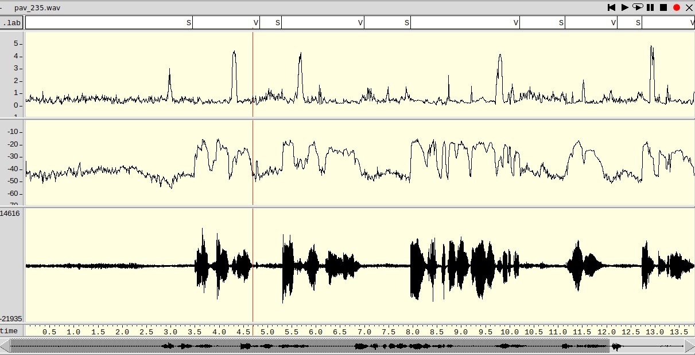
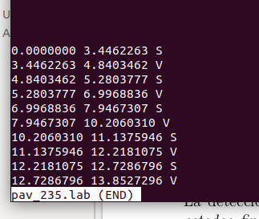
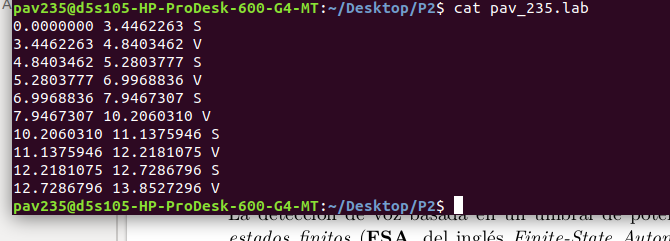
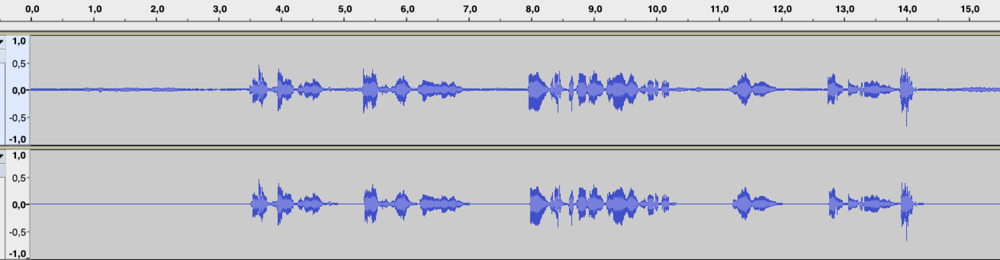
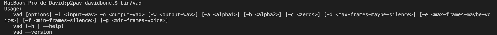
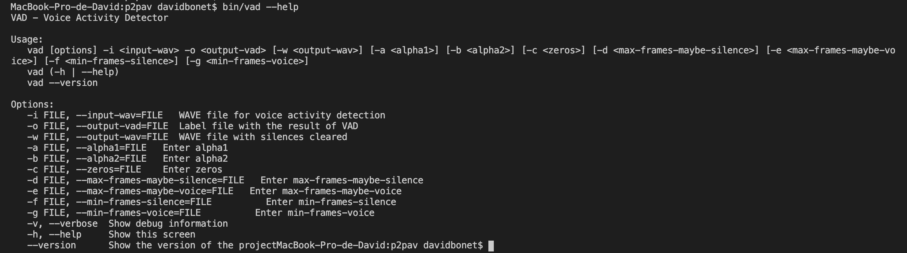

PAV - P2: detección de actividad vocal (VAD)
============================================

Esta práctica se distribuye a través del repositorio GitHub [Práctica 2](https://github.com/albino-pav/P2),
y una parte de su gestión se realizará mediante esta web de trabajo colaborativo.  Al contrario que Git,
GitHub se gestiona completamente desde un entorno gráfico bastante intuitivo. Además, está razonablemente
documentado, tanto internamente, mediante sus [Guías de GitHub](https://guides.github.com/), como
externamente, mediante infinidad de tutoriales, guías y vídeos disponibles gratuitamente en internet.


Inicialización del repositorio de la práctica.
----------------------------------------------

Para cargar los ficheros en su ordenador personal debe seguir los pasos siguientes:

*	Abra una cuenta GitHub para gestionar esta y el resto de prácticas del curso.
*	Cree un repositorio GitHub con el contenido inicial de la práctica (sólo debe hacerlo uno de los
	integrantes del grupo de laboratorio, cuya página GitHub actuará de repositorio central):
	-	Acceda la página de la [Práctica 3](https://github.com/albino-pav/P2).
	-	En la parte superior derecha encontrará el botón **`Fork`**. Apriételo y, después de unos segundos,
		se creará en su cuenta GitHub un proyecto con el mismo nombre (**P2**). Si ya tuviera uno con ese 
		nombre, se utilizará el nombre **P2-1**, y así sucesivamente.
*	Habilite al resto de miembros del grupo como *colaboradores* del proyecto; de este modo, podrán
	subir sus modificaciones al repositorio central:
	-	En la página principal del repositorio, en la pestaña **:gear:`Settings`**, escoja la opción 
		**Collaborators** y añada a su compañero de prácticas.
	-	Éste recibirá un email solicitándole confirmación. Una vez confirmado, tanto él como el
		propietario podrán gestionar el repositorio, por ejemplo: crear ramas en él o subir las
		modificaciones de su directorio local de trabajo al repositorio GitHub.
*	En la página principal del repositorio, localice el botón **Branch: master** y úselo para crear
	una rama nueva con los primeros apellidos de los integrantes del equipo de prácticas separados por
	guion (**fulano-mengano**).
*	Todos los miembros del grupo deben realizar su copia local en su ordenador personal.
	-	Copie la dirección de su copia del repositorio apretando en el botón **Clone or download**.
		Asegúrese de usar *Clone with HTTPS*.
	-	Abra una sesión de Bash en su ordenador personal y vaya al directorio **PAV**. Desde ahí, ejecute:

		```.sh
		git clone dirección-del-fork-de-la-práctica
		```

	-	Vaya al directorio de la práctica `cd P2`.
	-	Cambie a la rama **fulano-mengano** con la orden:

		```.sh
		git checkout fulano-mengano
		```

*	A partir de este momento, todos los miembros del grupo de prácticas pueden trabajar en su directorio
	local del modo habitual.
	-	También puede utilizar el repositorio remoto como repositorio central para el trabajo colaborativo
		de los distintos miembros del grupo de prácticas; o puede serle útil usarlo como copia de seguridad.
	-	Cada vez que quiera subir sus cambios locales al repositorio GitHub deberá confirmar los
		cambios en su directorio local:

		```.sh
		git add .
		git commit -m "Mensaje del commit"
		```

		y, a continuación, subirlos con la orden:

		```.sh
		git push -u origin fulano-mengano
		```

*	Al final de la práctica, la rama **fulano-mengano** del repositorio GitHub servirá para remitir la
	práctica para su evaluación utilizando el mecanismo *pull request*.
	-	Vaya a la página principal de la copia del repositorio y asegúrese de estar en la rama
		**fulano-mengano**.
	-	Pulse en el botón **New pull request**, y siga las instrucciones de GitHub.


Entrega de la práctica.
-----------------------

Responda, en este mismo documento (README.md), los ejercicios indicados a continuación. Este documento es
un fichero de texto escrito con un formato denominado _**markdown**_. La principal característica de este
formato es que, manteniendo la legibilidad cuando se visualiza con herramientas en modo texto (`more`,
`less`, editores varios, ...), permite amplias posibilidades de visualización con formato en una amplia
gama de aplicaciones; muy notablemente, **GitHub**, **Doxygen** y **Facebook** (ciertamente, :eyes:).

En GitHub. cuando existe un fichero denominado README.md en el directorio raíz de un repositorio, se
interpreta y muestra al entrar en el repositorio.

Debe redactar las respuestas a los ejercicios usando Markdown. Puede encontrar información acerca de su
sintáxis en la página web [Sintaxis de Markdown](https://daringfireball.net/projects/markdown/syntax).
También puede consultar el documento adjunto [MARKDOWN.md](MARKDOWN.md), en el que se enumeran los elementos
más relevantes para completar la redacción de esta práctica.

Recuerde realizar el *pull request* una vez completada la práctica.

Ejercicios
----------

### Etiquetado manual de los segmentos de voz y silencio

- Etiquete manualmente los segmentos de voz y silencio del fichero grabado al efecto. Inserte, a 
  continuación, una captura de `wavesurfer` en la que se vea con claridad la señal temporal, el contorno de
  potencia y la tasa de cruces por cero, junto con el etiquetado manual de los segmentos.
  
  


- A la vista de la gráfica, indique qué valores considera adecuados para las magnitudes siguientes:

	* Incremento del nivel potencia en dB, respecto al nivel correspondiente al silencio inicial, para estar
      seguros de que un segmento de señal se corresponde con voz.
      
      	  Primero de todo, analizamos la potencia media en fragmentos concretos de nuestro audio.
      		
		+ -42 dB en silencio.
		+ -29.9 dB en consonantes fricativas sordas /s/.
		+ -25 dB en consonantes sonoras /m/, /n/.
		+ -20 dB aproximadamente, promediando las estadisticas de fragmentos vocales de todo el audio.
		
	  Con estos datos, podríamos considerar como un buen incremento de nivel de potencia inicial unos 10 dB.
		
	* Duración mínima razonable de los segmentos de voz y silencio.
	
	  Para la voz, podemos tomar como duración mínima unos 50 ms. Para el silencio, en cambio, podríamos considerar un 	     tiempo menor, de unos 20 ms.

	* ¿Es capaz de sacar alguna conclusión a partir de la evolución de la tasa de cruces por cero?
	
	  La evolución de cruces por cero no resulta muy útil para la detección de voz en general, en cambio, en el caso 	   específico de las consonantes fricativas como /s/ y /x/ si que es una muy buena herramienta.
	  
	  Los cruces mantienen un nivel bastante constante (alrededor de 500) con poca varianza, excepto en el caso de las 	     mencionadas fricativas, donde la tasa de cruces por cero se dispara, por encima de los 1500. Estas consonantes son 	  pronunciadas con un nivel de potencia muy bajo, por lo que contar con la información de esta tasa nos es muy útil 	      para no detectar como silencio un fragmento que realmente es de voz.
	  
	* Visualización de la transcripción
	  
	Con la ayuda de *less* o *cat* podemos visualizar una lista de las etiquetas creadas para un archivo de audio, 		viendo en que intervalo se han asignado y su correspondiente etiqueta.
	
	**Visualización de etiquetas con less:**
	
	
	**Visualización de etiquetas con cat:**
	
	


### Desarrollo del detector de actividad vocal

  Para poder mantener el código del proyecto hemos usado meson y ninja. Una vez creado el fichero **meson.build** para 	       seleccionar que ficheros queremos mantener, ejecutamos `meson bin`, que nos configura el directorio **bin**. Ejecutamos     ninja `ninja -C bin` para compilar el programa. Una vez compilado ya tenemos el nuestro programa ejecutable que se           ejecutará con `bin/vad`.
  
- Complete el código de los ficheros de la práctica para implementar un detector de actividad vocal tan
  exacto como sea posible. Tome como objetivo la maximización de la puntuación-F `TOTAL`.
  
  El código completo se encuentra en esta misma branca del repositorio. En cuanto al algoritmo de detección, hemos sido tan
  fieles a la explicación proporcionada por el profesor como nos ha sido posible. Es decir, hemos implementado la máquina de 
  estados que viene descrita en las páginas 4, 5, y 6 del archivo _**p2_vad.pdf**_.
  
  En lo que respecta al nivel de interferencia del ruido de fondo, nuestra elección de diseño consiste en calcularlo a         partir de la media de las potencias en decibelios de las N primeras tramas, consideradas como estado inicial y en el cual hay silencio.
  
  También hemos utilizado dos umbrales de decisión distintos, para conseguir una funcionalidad basada en histéresis explicada en la página 7 del archivo _**p2_vad.pdf**_.
  
  Las características de la señal que hemos aprovechado para implementar nuestro algoritmo son las siguientes:
  * Potencia del tramo de señal, en dB, con dos umbrales distintos.
  * Tasa de cruces por cero (zcr), para discernir las consonantes fricativas (/s/ y /x/, por ejemplo).
  * Duración mínima de silencio.
  * Duración mínima de voz.
  * Duración máxima de maybe silence.
  * Duración máxima de maybe voice.
  
  No hemos tenido en cuenta la amplitud media ya que hemos considerado que, al tener una forma muy parecida a la potencia no
  aportaría demasiado al algoritmo.
  

- Inserte una gráfica en la que se vea con claridad la señal temporal, el etiquetado manual y la detección
  automática conseguida para el fichero grabado al efecto. 
  
  

- Explique, si existen, las discrepancias entre el etiquetado manual y la detección automática.
  
  Existen bastantas diferencias ya que el etiquetado manual fue llevado a cabo segun nuestras percepciones subjetivas y la     detección automática se basa en unos cuantos parámetros estadísticos (las etiquetas manuales son las superiores y las       creadas por el VAD son las inferiores).
  
  * A partir de la tercera etiqueta, vemos que el VAD detecta un pequeño fragmento de silencio donde nosotros habíamos 	         marcado voz. Esto se debe a que ese fragmento de voz se corresponde a una pausa entre palabras que nosotros no               consideramos como un fragmento de silencio, pero el VAD sí que lo detecta ya que para mejorar la puntuación-F, los           resultados eran mejores considerando una duración mínima menor de los fragmentos de silencio.
  * Sobre el segundo 12" del audio, se puede observar como el etiquetado manual alarga más el fragmento de voz respecto al       VAD. El VAD hace un etiquetado coherente, pero el etiquetado manual se corresponde mejor con la percepión humana ya que     en ese caso, el hablante esta acabando una palabra con la letra /o/, de forma muy suave y, por tanto, con muy poca           potencia.
  * Finalmente, el último fragmento de voz que detecta el VAD, no está etiquetado manualmente. Esto se debe a que ese sonido     es un ruido causado por un golpe en el micrófono. El VAD lo detecta porque sus características estadísticas son             parecidas a las de la voz humana, concretamente a las de una consonante fricativa, pero en este caso no es así. 

  Como nuestro VAD tampoco es muy sofisticado, una solución hubiese sido etiquetar este ruido para que se correspondiera       con el resultado automático, pero creemos que estas diferencias son una buena forma de demostrar los fallos fáciles que     puede tener un VAD con estas características.
  

- Evalúe los resultados sobre la base de datos `db.v4` con el script `vad_evaluation.pl` e inserte a 
  continuación las tasas de sensibilidad (*recall*) y precisión para el conjunto de la base de datos (sólo
  el resumen).
  
  Como podemos observar, hemos obtenido un resultado `TOTAL` de las medidas-F de **XX.XXX%**, lo cual puede ser considerado
  como un resultado bastante bueno. De hecho, si lo ejecutamos sobre un archivo concreto para visualizar en el `wavesurfer` los labels generados por nuestro programa, visualmente nos parece que todo cuadra muy bien.
  
  (foto1)


### Trabajos de ampliación

#### Cancelación del ruido en los segmentos de silencio

- Si ha desarrollado el algoritmo para la cancelación de los segmentos de silencio, inserte una gráfica en
  la que se vea con claridad la señal antes y después de la cancelación (puede que `wavesurfer` no sea la
  mejor opción para esto, ya que no es capaz de visualizar varias señales al mismo tiempo).
  
  En el caso de la imagen, el audio original tiene un ruido de fondo bastante notable ya que fue grabado durante una sesión de laboratorio. Podemos ver como, en el audio resultante, la cancelación de ruido en los segmentos de silencio funciona de manera eficiente y se conservan perfectamente los segmentos de voz. 
  
  

#### Gestión de las opciones del programa usando `docopt_c` 

- Si ha usado `docopt_c` para realizar la gestión de las opciones y argumentos del programa `vad`, inserte
  una captura de pantalla en la que se vea el mensaje de ayuda del programa.
  
  Lo hemos implementado de tal forma que se puedan gestionar los siguientes parámetros:
  * Umbral bajo de potencia
  * Umbral alto de potencia
  * Umbral de cruces por cero (zcr)
  * Duración mínima de señal de silencio
  * Duración mínima de señal de voz
  * Duración máxima de maybe silence
  * Duración máxima de maybe voice
  
  
  
  
  
  Para facilitar la edición del `docopt`, hicimos un comando que automáticamente ejecuta todos los pasos necesarios que hay 
  que realizar:
  ```.sh
  	rm -r bin
	rm src/vad.docopt.h
	meson bin
	docopt_c/docopt_c.py src/vad.docopt -o src/vad.docopt.h
	ninja -C bin
  ```


### Contribuciones adicionales y/o comentarios acerca de la práctica

- Indique a continuación si ha realizado algún tipo de aportación suplementaria (algoritmos de detección o 
  parámetros alternativos, etc.).
  
  Encontrar el valor óptimo de los 7 parámetros que hemos decidido utilizar sería un quebradero de cabeza. Con la finalidad
  de agilizar esta optimización, desarrollamos un script que ejecutara en bucle el código contenido dentro de `run_vad.sh`,
  asignando cada vez un valores distintos a los parámetros. También modificamos parte del script `vad_evaluation.pl` para que solamente se imprimiera por pantalla el porcentaje `TOTAL`, y de esta manera podíamos tenerlo todo mejor organizado.
  
  (foto4)
  
  Al principio, tuvimos un problema y es que, en alguna de las ejecuciones, de manera totalmente aleatoria, daba error al
  abrir alguno de los ficheros de audio. Este problema es bien conocido por nuestro profesor, y parece que no se conoce muy
  bien su procedencia.
  
  (foto5)
  
  Una primera solución que ideamos fue la de escribir otro script que ejecutara este primer script
  contínuamente hasta que diera un resultado exitoso, con la esperanza de que en alguna de las ejecuciones no ocurriría el
  error aleatorio:
  
  (foto6)
  
  Sin embargo, dejándolo toda la noche correr, amanecimos y todavía no había habido una ejecución exitosa. Tomamos esta misma idea para solamente re-ejecutar la línea de código de run_vad.sh que llama a `bin/vad` y la que llama a `vad_evaluation.pl`
  en caso de que alguna de estas retornara error. De esta manera, no teníamos que volver a empezar el bucle de parámetros 
  sino que lo retomábamos desde el sitio donde había surgido el error.
  
  (foto7)
  
  Así pues, conseguimos finalmente una manera de ejecutar en bucle el programa, cambiando automáticamente los parámetros en
  cada ejecución y sin errores, para poder obtener los valores óptimos de cada parámetro

- Si lo desea, puede realizar también algún comentario acerca de la realización de la práctica que considere
  de interés de cara a su evaluación.


### Antes de entregar la práctica

Recuerde comprobar que el repositorio cuenta con los códigos correctos y en condiciones de ser 
correctamente compilados con la orden `meson bin; ninja -C bin`. El programa generado (`bin/vad`) será
el usado, sin más opciones, para realizar la evaluación *ciega* del sistema.
